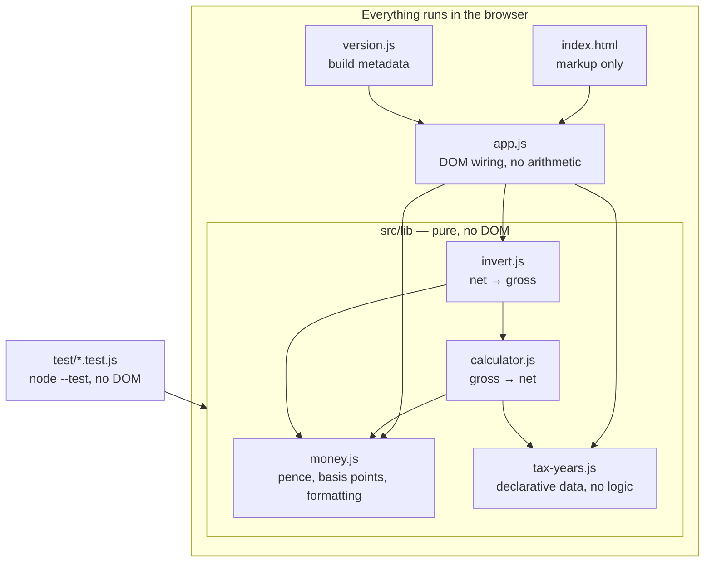
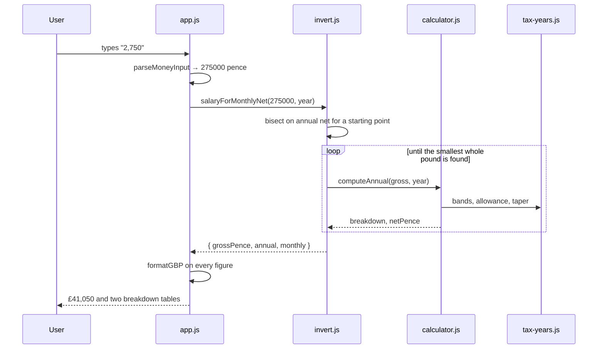
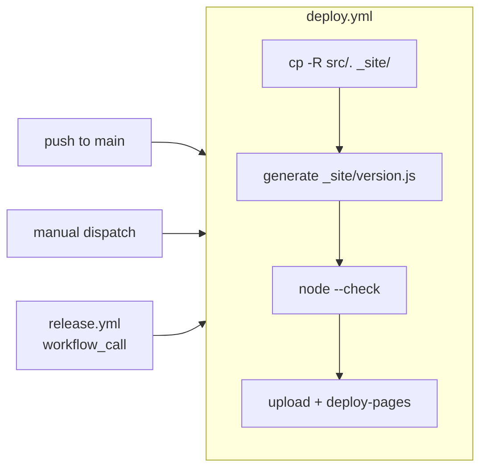

# Architecture

How Wager is put together, and why. For the rules you must follow when changing
it, see [CLAUDE.md](../CLAUDE.md). For the procedure to update tax figures, see
[updating-tax-rates.md](updating-tax-rates.md).

## The problem

Nearly every salary calculator goes **gross → net**. Wager goes **net → gross**:
you know what you want to take home each month, and you need to know what salary
to ask for.

That direction is harder than it looks, and most of this document is about why.

## Shape of the system



The dependency arrows only ever point *into* `src/lib`. Nothing in `src/lib`
knows the DOM exists, which is why the whole calculation is covered by tests that
run in plain Node with no browser and no test framework.

`app.js` contains **no arithmetic**. If you find yourself computing something
there, it belongs in `src/lib`.

## Data flow for one calculation



## The five decisions that shape everything

### 1. Money is integer pence; rates are integer basis points

JavaScript has no decimal type, and adding one would break the
no-runtime-dependencies rule. It isn't needed:

| Quantity | Representation | Example |
|---|---|---|
| Money | integer pence | `1_257_000` is £12,570 |
| Rates | integer basis points | `1900` is 19% |
| Intermediate charges | basis-point units (ten-thousandths of a penny) | `amountInBandPence * rateBasisPoints` |

`0.21` is not exactly representable in binary floating point; `2100` is. Charges
accumulate in basis-point units and convert to pence exactly once, via
`roundHalfUp`. **No step of the calculation involves a float.**

The largest product in play is about £1m of income at the top rate — roughly
`4.8e11`, comfortably inside `Number.MAX_SAFE_INTEGER`. BigInt would be overkill,
and `invert.js` caps gross at £100,000,000 partly to keep it that way.

Pounds exist only at the two edges: `parseMoneyInput` on the way in, `formatGBP`
on the way out. Parsing is done on the *string*, because `1234.56 * 100` is
`123455.99999999999`.

### 2. Income tax bands are stored on a *taxable* basis

This is the single easiest thing to get wrong, so it has its own section in
[updating-tax-rates.md](updating-tax-rates.md).

gov.scot publishes bands as ranges of **gross** income. The config stores
cumulative limits on **taxable** income (gross minus the personal allowance).
`publishedBands` carries the official gross table alongside, purely for display,
and a test asserts the two representations agree.

The advanced-rate limit is **£125,140**, not £112,570. By that income the
personal allowance has tapered fully away, so taxable equals gross. An
independent calculator we cross-checked against gets this wrong and over-deducts
for everyone above £112,570 — see `test/calculator.test.js`, which reproduces
their figures exactly by injecting the error.

National Insurance ignores the allowance entirely, so its bands are cumulative
limits on **gross** income. Each scheme declares its own `appliesTo`.

### 3. The combined deduction is rounded once, then shared out

Rounding each band's charge separately breaks monotonicity. A real example:

```
gross £12,570.18   tax £0.0342 → £0.03   NI £0.0144 → £0.01   net £12,570.14
gross £12,570.19   tax £0.0361 → £0.04   NI £0.0152 → £0.02   net £12,570.13
```

Both charges cross their rounding boundary on the same penny, so a 1p pay rise
costs 2p and **take-home pay falls**.

Instead `computeAnnual` sums the exact charges, rounds the *combined* deduction
once, and distributes that single integer back across the bands by largest
remainder. Because the worst-case marginal deduction is well under 100%, one
more penny of gross can never cost more than one more penny of deductions.

Two properties fall out, and both matter:

- **Net pay never falls as gross pay rises.** The inversion depends on it.
- **Every breakdown adds up exactly.** The UI tables can never look like they
  have arithmetic errors.

This is *not* fixable by rounding the income-tax subtotal and the NI subtotal
separately. Any two independent roundings can cross their boundaries on the same
penny. Exactly one rounding is the minimum that works.

### 4. Net → gross is bisection, with an explicit contract

> `grossFromAnnualNet(target)` returns **the smallest integer gross whose net is
> at least the target**.

The wording is load-bearing. Because deductions are rounded, net pay is a
non-decreasing **step function** with plateaus:

```
gross £119,999.99  →  net £71,357.35
gross £120,000.00  →  net £71,357.35     same net, one penny more gross
```

So "which gross gives exactly this net?" often has several answers or none.
Smallest-sufficient makes the result unique and never leaves anyone short of
what they asked for.

Bisection rather than inverting each band algebraically: it is a dozen lines,
converges in about forty iterations, and stays correct if a future tax year
gains a band, changes the taper ratio, or introduces a new deduction. Given that
adding a tax year must be a data-only change, that robustness is the point.

### 5. The *monthly* search works in whole pounds

Two separate traps here, both found by running the real page rather than by
tests.

**Multiplying by twelve is wrong.** A monthly figure is rounded to the penny, so
twelve of them need not equal the annual net. £60,000 takes home £3,633.95 a
month, but twelve of those is £43,607.40 — five pence more than the £43,607.35
that salary actually pays. Inverting the annual net therefore answered
"£60,001" for a take-home that £60,000 delivers exactly. `salaryForMonthlyNet`
targets the monthly figure directly.

**Monthly net is not monotonic.** It is monthly gross minus monthly deductions,
each rounded separately, so it wobbles:

```
gross £44,999.94   monthly net £2,960.30   ok
gross £45,000.00   monthly net £2,960.30   ok      ← the answer
gross £45,000.01   monthly net £2,960.29   short
gross £45,000.05   monthly net £2,960.29   short
gross £45,000.06   monthly net £2,960.30   ok      ← a penny-walk stops here, £1 high
```

So the search steps in **whole pounds**. A pound of gross moves monthly net by
several pence, comfortably more than the one-penny wobble, so the function is
well behaved at that granularity — and it is the right granularity anyway, since
the output is a salary to negotiate with. Nobody asks for £119,999.99.

The quoted figure is rounded **up**, never to nearest, so it always clears the
target rather than falling a penny short.

## Module reference

| Module | Exports | Notes |
|---|---|---|
| `money.js` | `parseMoneyInput`, `formatGBP`, `formatPercent`, `poundsToPence`, `penceToPounds`, `ceilToPound`, `roundHalfUp`, `basisPointsToRate`, `assertPence`, `PENCE_PER_POUND`, `BASIS_POINTS` | The only place pounds exist |
| `tax-years.js` | `TAX_YEARS`, `DEFAULT_TAX_YEAR_ID`, `getTaxYear`, `listTaxYearIds` | **Data only.** No logic, no `if` about tax |
| `calculator.js` | `computeAnnual`, `toMonthly`, `personalAllowanceFor`, `applyBands`, `marginalRateAt` | **No tax figures.** Reads them from the config it is given |
| `invert.js` | `salaryForMonthlyNet`, `grossFromAnnualNet`, `grossFromMonthlyNet` | `salaryForMonthlyNet` is what the UI uses |
| `app.js` | — | DOM wiring only |
| `version.js` | `BUILD` | Committed dev stub, regenerated at deploy |

`marginalRateAt` is derived from the config rather than by differencing two
calculations, so it is exact at band boundaries. It returns the rate on the
*next* pound — at the last pound of a band it reports the band above, which is
where that next pound actually lands.

## Testing strategy

`npm test` — Node's built-in runner, `node:assert/strict`, no dependencies,
about two seconds.

| File | Guards |
|---|---|
| `money.test.js` | Parsing, half-up rounding, formatting round-trips |
| `tax-years.test.js` | Config invariants, published-vs-taxable agreement, **the monotonicity property** |
| `calculator.test.js` | Known values at every published boundary, the £112,570 regression |
| `invert.test.js` | Contract edge cases, plateaus, bracket termination |
| `roundtrip.test.js` | ~2,900 gross values swept: `net(g) >= target` **and** `net(g-1) < target` |

Two deserve special mention.

**The monotonicity guard sweeps the taper exhaustively** — all 2,514,000 pennies
between £100,000 and £125,140, asserting a penny of gross never costs more than
a penny of deductions. It was originally a strided sample; review pointed out
that a stride is a spot check, not a proof, since violations recur with a period
determined by the rates and could sit between samples. Two seconds buys an
unconditional guarantee.

**Round-trip tests assert minimality, not just sufficiency.** Sufficiency alone
is satisfied by returning a huge number. `net(g-1) < target` is the half that
actually pins the contract down.

Tax-year figures are also mutation-tested by hand when changed — see the runbook.

## Build, version and deploy

There is no build step. The published site is `src/` copied verbatim, plus one
generated file.



`src/version.js` is a committed **dev stub** so the site works when opened
locally. The workflow overwrites it *in the staging directory only* — the stub
is never modified in git. The footer links to
`https://github.com/mnem/wager/tree/<full 40-char SHA>`.

The version comes from the release tag when deploying a release, or
`git describe --tags --always` on a push to main (giving honest strings like
`v1.2.0-3-gabc1234`).

### The workflow trap worth knowing about

`deploy.yml` is deliberately **not** triggered by `on: release: [published]`.
Releases created with `GITHUB_TOKEN` do not trigger further workflows, so that
deploy would never fire. `release.yml` calls it via `workflow_call` instead.

The same rule means a `@claude` review request posted by a workflow using
`GITHUB_TOKEN` will not trigger the review — it must come from a person or from
a contributor using their own auth.

## What this deliberately does not do

No pension contributions or salary sacrifice, no student or postgraduate loans,
no benefits in kind, no tax code other than the standard one, no marriage or
blind person's allowance, and no savings or dividend income (taxed at UK-wide
rates even for Scottish taxpayers).

National Insurance is calculated annually; real payroll calculates it per pay
period, so a real payslip can differ slightly. All of this is stated on the page
rather than only here.
